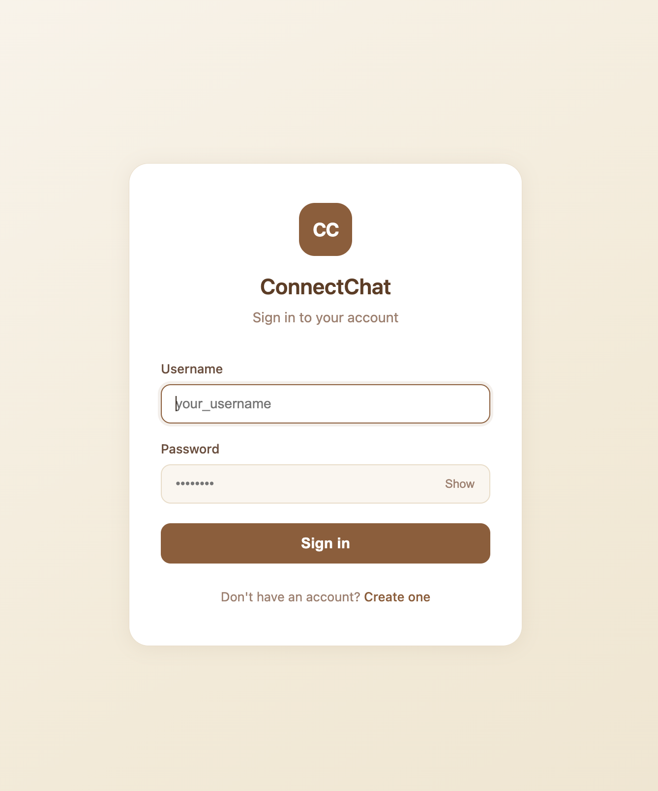
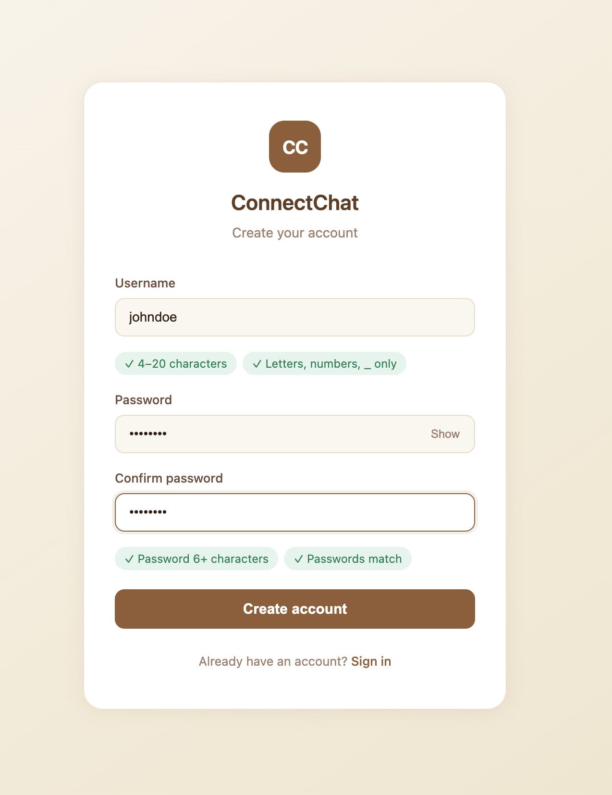
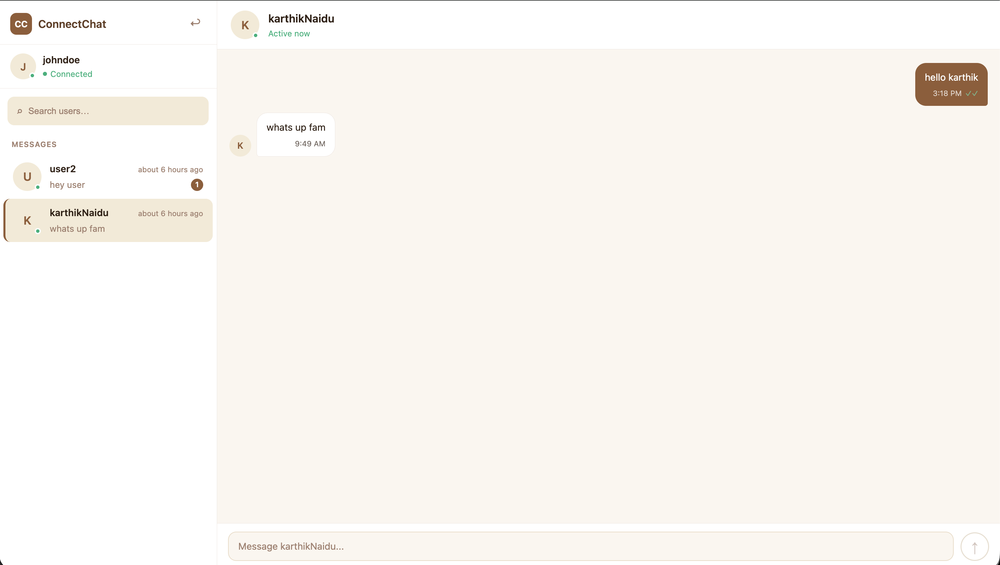
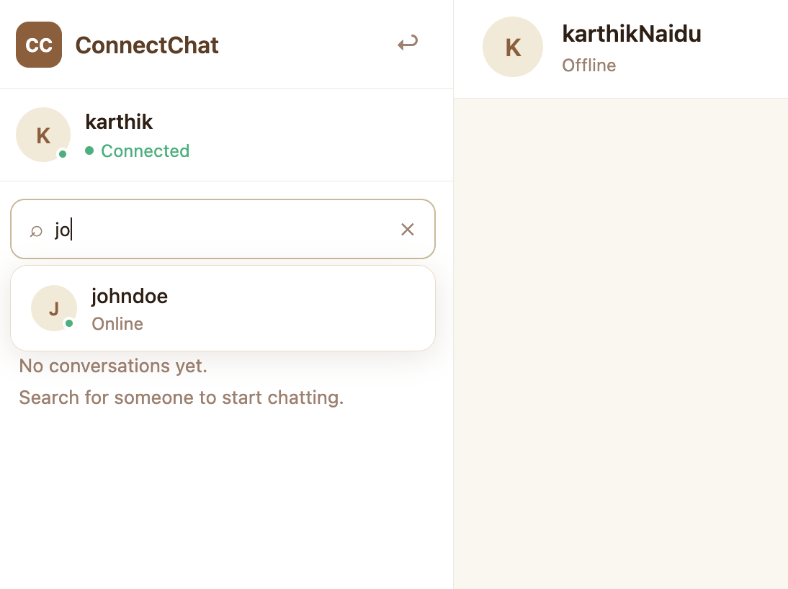
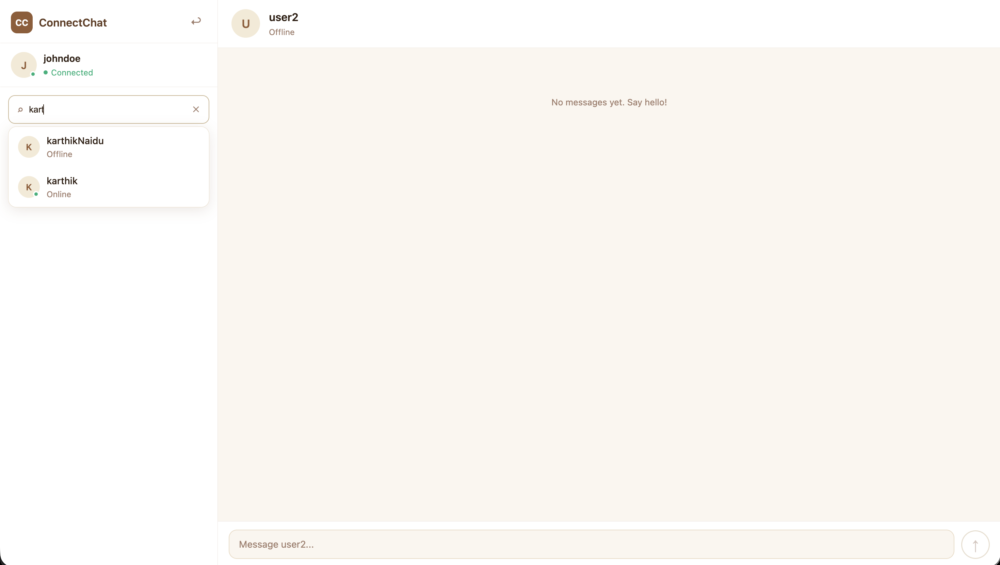

<div align="center">

<br/>


<br/>

**Real-time chat platform with WebSocket messaging, JWT authentication, and AWS deployment.**

<br/>

[](https://chat.karthiknarravula.dev)
[](https://api.karthiknarravula.dev/swagger-ui/index.html)
[](https://karthiknarravula.dev)

<br/>


</div>

<br/>

---

## 📸 Screenshots

<div align="center">

<table>
  <tr>
    <td align="center"><b>Login</b></td>
    <td align="center"><b>Register</b></td>
  </tr>
  <tr>
    <td></td>
    <td></td>
  </tr>
</table>


<br/><em>Chat Interface</em>

<br/><br/>

<table>
  <tr>
    <td align="center"><b>Search Users</b></td>
    <td align="center"><b>Search Results</b></td>
  </tr>
  <tr>
    <td></td>
    <td></td>
  </tr>
</table>

</div>

---

## 🔗 Live Links

| Resource | URL |
|:---|:---|
| 🌐 Frontend | [chat.karthiknarravula.dev](https://chat.karthiknarravula.dev) |
| ⚙️ Backend API | [api.karthiknarravula.dev](https://api.karthiknarravula.dev) |
| 📖 Swagger UI | [/swagger-ui/index.html](https://api.karthiknarravula.dev/swagger-ui/index.html) |
| 📄 OpenAPI JSON | [/v3/api-docs](https://api.karthiknarravula.dev/v3/api-docs) |

---

## ✨ Features

<table>
<tr>
<td width="50%">

### 🔐 Authentication & Security
- JWT access + refresh token flow
- Google OAuth2 login integration
- Protected APIs via Spring Security
- Password validation
- Automatic token refresh handling

### ⚡ Real-Time Messaging
- Private messaging via WebSocket + STOMP
- Online / offline user presence tracking
- Read receipts
- Optimistic UI updates
- Typing indicators *(V2 planned)*

</td>
<td width="50%">

### 🎨 Frontend
- Responsive React UI
- Modern chat interface
- Mobile-friendly sidebar
- Conversation previews
- Live updates without page refresh

### ☁️ DevOps & Cloud
- Dockerized backend on AWS EC2
- AWS RDS PostgreSQL database
- Nginx reverse proxy with HTTPS
- Custom domain configuration
- GitHub Actions CI/CD 

</td>
</tr>
</table>

---

## 🛠 Tech Stack

| Layer | Technologies |
|:---|:---|
| **Backend** | Java 21 · Spring Boot 3 · Spring Security · Spring WebSocket · Spring Data JPA · Hibernate · PostgreSQL · JWT · OAuth2 Client |
| **Frontend** | React · React Router · SockJS · STOMP.js · date-fns |
| **DevOps / Cloud** | Docker · Docker Hub · AWS EC2 · AWS RDS · Nginx · GitHub Actions · Vercel |

---

## 🏗 Architecture

```
┌─────────────────────────────────┐
│     React Frontend  (Vercel)    │
└────────────────┬────────────────┘
                 │  HTTPS
                 ▼
┌─────────────────────────────────┐
│       Nginx Reverse Proxy       │
└────────────────┬────────────────┘
                 │
                 ▼
┌─────────────────────────────────┐
│  Spring Boot Backend            │
│  (Docker Container on EC2)      │
│                                 │
│  ┌──────────┐  ┌─────────────┐  │
│  │ REST API │  │  WebSocket  │  │
│  └──────────┘  └─────────────┘  │
└────────────────┬────────────────┘
                 │
                 ▼
┌─────────────────────────────────┐
│    PostgreSQL Database          │
│         (AWS RDS)               │
└─────────────────────────────────┘
```
##🔐 Authentication Flow
```
User Login
 __________________________________
|    │                             |
|    ├── Email + Password          |
|    │        │                    |
|    │        ▼                    |
|    │   Spring Security           |
|    │        │                    |
|    │        ▼                    |
|    │       JWT                   |
|    |                             | 
|    └── Google OAuth2             |
|             │                    |
|             ▼                    |
|       Google Consent             |
|             │                    |
|             ▼                    |
|      OAuth2 Callback             | 
|             │                    |
|             ▼                    |
|       JWT Generation             |
|__________________________________|
```

---

## 🚀 Running Locally

### Prerequisites
- Java 21+
- Node.js 18+
- PostgreSQL

### 1 · Clone the Repository

```bash
git clone https://github.com/Karthik0806/functional-chat-application.git
cd functional-chat-application
```

### 2 · Configure Environment Variables

Create a `.env` file in the project root:

```env
SPRING_PROFILES_ACTIVE=prod
CLIENT_ID=your_google_client_id
CLIENT_SECRET=your_google_client_secret

DB_URL=your_database_url
DB_USERNAME=your_database_username
DB_PASSWORD=your_database_password

JWT_SECRET=your_jwt_secret
```

### 3 · Start the Backend

```bash
./mvnw spring-boot:run
```

### 4 · Start the Frontend

```bash
npm install
npm start
```

> The app will be available at `http://localhost:3000`

---

## 🐳 Docker Deployment

### Build & Push Image

```bash
docker buildx build \
  --platform linux/amd64 \
  -t karthi2005/connectchat-backend:latest \
  --push .
```

### Deploy to EC2

```bash
./deploy.sh
```

---

## ⚙️ CI/CD Pipeline

The GitHub Actions workflow runs automatically on every push:

```
Push to main
     │
     ▼
Build Docker Image
     │
     ▼
Push to Docker Hub
     │
     ▼
SSH into EC2
     │
     ▼
Pull & Restart Container
```

---

## 🗺 Roadmap

| Status | Feature |
|:---:|:---|
| ✅ | Private real-time messaging |
| ✅ | JWT authentication + refresh tokens |
| ✅ | Read receipts & online presence |
| ✅ | Docker + AWS EC2 deployment |
| ✅ | GitHub Actions CI/CD |
| ✅ | Google oauth2 |
| 🔲 | Contacts
| 🔲 | Typing indicators |
| 🔲 | Redis for scalable presence tracking |
| 🔲 | Message pagination |
| 🔲 | Group chat support |
| 🔲 | File & image sharing |
| 🔲 | Push notifications |
| 🔲 | Voice / video calls |
| 🔲 | Kubernetes deployment |
| 🔲 | Monitoring with Prometheus & Grafana |

---

## 📚 What I Learned

Building ConnectChat gave me hands-on experience across the full stack:

- **Real-time systems** — Designing bidirectional communication with WebSockets and STOMP
- **Security** — Implementing a robust JWT access + refresh token flow with Spring Security
- **OAuth2 & Identity** — Integrating Google OAuth2 login with JWT-based authentication flows
- **Containerization** — Dockerizing a Spring Boot app for consistent, portable deployments
- **Reverse proxying** — Configuring Nginx for SSL termination and API routing
- **Cloud deployment** — Provisioning, deploying, and debugging on AWS EC2 + RDS
- **CI/CD** — Automating the build and deploy pipeline with GitHub Actions
- Deployment & debugging — Troubleshooting issues across Docker, Nginx, and AWS infrastructure

---

## 👤 Author

<div align="center">

**Karthik Narravula**

[](https://github.com/Karthik0806)
[](https://karthiknarravula.dev)
[](https://www.linkedin.com/in/karthik-narravula)

</div>

---

## 📄 License

This project is built for educational and portfolio purposes. Feel free to explore the code and architecture — and don't forget to star ⭐ the repo if you found it useful!

---

<div align="center">

*Made with ☕ and a lot of debugging by [Karthik Narravula](https://karthiknarravula.dev)*

</div>
